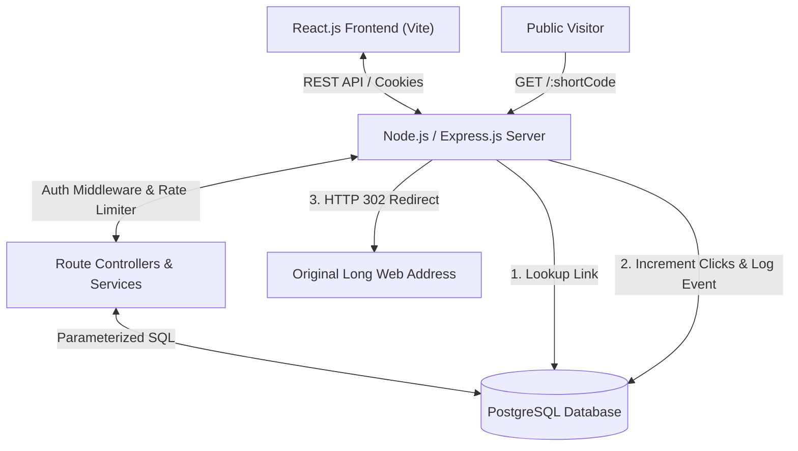
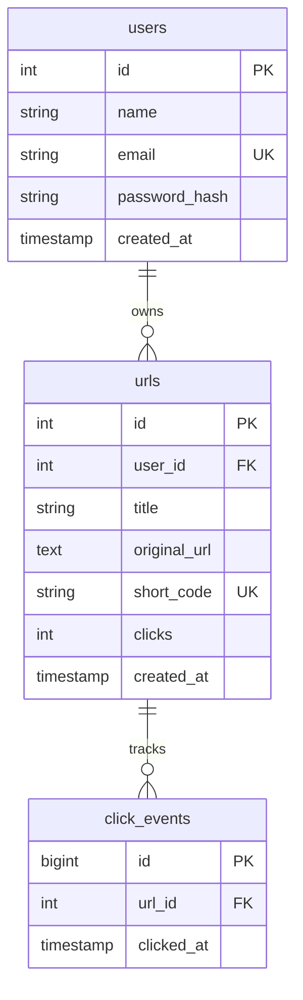

# LinkShort - URL Shortener with User Authentication and Analytics

[](https://github.com/username/url-shortener/actions)
[](LICENSE)
[](https://nodejs.org)
[](https://www.postgresql.org/)

LinkShort is a complete, modern, production-grade full-stack URL Shortener web application. Built with React.js, Node.js/Express, and PostgreSQL, it provides custom short links, real-time engagement tracking, interactive visual analytics, and secure JWT-based multi-user link management.

---

## Table of Contents
1. [Problem Statement & Objectives](#problem-statement--objectives)
2. [Key Features](#key-features)
3. [Technology Stack](#technology-stack)
4. [System Architecture](#system-architecture)
5. [Database Schema](#database-schema)
6. [API Endpoints](#api-endpoints)
7. [Local Setup Guide](#local-setup-guide)
8. [PostgreSQL Setup & Docker](#postgresql-setup--docker)
9. [Running Automated Tests](#running-automated-tests)
10. [Postman Collection](#postman-collection)
11. [Deployment Instructions](#deployment-instructions)
12. [Security Considerations](#security-considerations)
13. [Screenshots](#screenshots)
14. [Documentation Index](#documentation-index)

---

## Problem Statement & Objectives

### Problem Statement
Long URLs with complex tracking query strings look messy, consume character limits, and lack actionable engagement feedback. Existing public url shorteners often lock custom branding and analytics behind paywalls or lack data privacy controls.

### Objectives
- Build a full-stack SaaS application from scratch.
- Enable users to register, log in, create custom short URLs, and track performance.
- Perform high-speed HTTP 302 redirects with atomic click counter updates.
- Store accurate, timestamped click events for analytics graphs.
- Maintain high security standards (bcrypt hashing, JWT cookies, rate limiting, SQL injection defense).

---

## Key Features
- **SaaS Dashboard UI**: Clean layout with sidebar navigation and responsive light/dark mode.
- **Custom Short Aliases**: Choose personalized short codes or auto-generate unique random codes.
- **Real-Time Click Analytics**: Interactive Recharts graphs showing daily click trends over time.
- **Link Management**: Search links by title/URL/alias, sort by date or click count, and paginate results.
- **Secure Auth**: JWT tokens stored in HTTP-only cookies with fallback Bearer header support.
- **Safety Checks**: Server-side URL format validation to prevent open redirects; reserved route protection to avoid URL collisions.
- **Deletion Confirmations**: Confirmation modal before link deletion to prevent accidental data loss.

---

## Technology Stack

### Frontend
- **Framework**: React 18 + Vite
- **Routing**: React Router DOM v6
- **HTTP Client**: Axios with request/response interceptors
- **Analytics Charts**: Recharts
- **Icons**: Lucide React
- **Styling**: Modern CSS variables supporting Light/Dark themes

### Backend
- **Runtime**: Node.js v18+
- **Web Framework**: Express.js
- **Database Driver**: `pg` (PostgreSQL Client)
- **Security**: bcryptjs, jsonwebtoken, helmet, express-rate-limit, cookie-parser, cors

### Database
- **Engine**: PostgreSQL 15
- **Features**: Foreign keys (`ON DELETE CASCADE`), B-Tree indexes, atomic query counters.

---

## System Architecture



---

## Database Schema



---

## API Endpoints

| Method | Endpoint | Auth Required | Description |
| :--- | :--- | :--- | :--- |
| `GET` | `/api/health` | No | Server health and uptime check |
| `POST` | `/api/auth/register` | No | Register new user account |
| `POST` | `/api/auth/login` | No | Authenticate user & issue JWT |
| `GET` | `/api/auth/me` | Yes | Get authenticated user profile |
| `POST` | `/api/auth/logout` | Yes | Clear authentication cookie |
| `PATCH` | `/api/auth/profile` | Yes | Update user profile name |
| `POST` | `/api/urls` | Yes | Create a shortened URL |
| `GET` | `/api/urls` | Yes | List user URLs (search, sort, paginate) |
| `GET` | `/api/urls/:id` | Yes | Get single URL details |
| `PATCH` | `/api/urls/:id` | Yes | Update URL title or alias |
| `DELETE` | `/api/urls/:id` | Yes | Delete short URL and click events |
| `GET` | `/api/analytics/overview` | Yes | Dashboard overall analytics summary |
| `GET` | `/api/analytics/urls/:id` | Yes | Link-specific click analytics |
| `GET` | `/:shortCode` | No | Public short URL redirection endpoint |

---

## Local Setup Guide

### Prerequisites
- Node.js v18 or higher (`node -v`)
- npm v9 or higher (`npm -v`)
- Docker Desktop or local PostgreSQL 15 server

### Step-by-Step Installation

1. **Clone the repository & enter project directory**:
   ```bash
   git clone https://github.com/username/url-shortener.git
   cd url-shortener
   ```

2. **Setup Backend Environment**:
   ```bash
   cd server
   cp .env.example .env
   npm install
   ```

3. **Setup Frontend Environment**:
   ```bash
   cd ../client
   cp .env.example .env
   npm install
   ```

Or from the repository root:

```bash
npm run install:all
```

---

## PostgreSQL Setup & Docker

### Option A: Using Docker Compose (Recommended)
Start PostgreSQL in a detached container:
```bash
cd url-shortener
docker compose up -d
```
This automatically initializes the database tables defined in `database/schema.sql`.

### Option B: Local PostgreSQL Installation
If you prefer running PostgreSQL natively on macOS via Homebrew:
```bash
brew services start postgresql@15
createdb linkshort_db
psql -d linkshort_db -f database/schema.sql
```

### Option C: Optional Seed Data
To populate demo data:
```bash
psql -U linkshort_user -d linkshort_db -f database/seed.sql
```

---

## Running the Application

### 1. Start Backend Server
```bash
cd url-shortener/server
npm run dev
```
The backend API server will run on `http://localhost:5000`.

### 2. Start Frontend App
```bash
cd url-shortener/client
npm run dev
```
The React application will run on `http://localhost:5173`.

---

## Running Automated Tests

Run the backend integration test suite using Jest (powered by `pg-mem` in-memory database):
```bash
cd url-shortener/server
npm test
```

---

## Postman Collection

Import the Postman collection to test API routes:
1. Open Postman.
2. Click **Import** and select `url-shortener/postman/LinkShort.postman_collection.json`.
3. Set environment variable `baseUrl` to `http://localhost:5000`.

---

## 🚀 Deployment Instructions

**Recommended: deploy as ONE Railway web service** (Express serves the React build) plus a Railway PostgreSQL database.

```
https://YOUR-RAILWAY-DOMAIN/          → React frontend
https://YOUR-RAILWAY-DOMAIN/api/...   → REST API
https://YOUR-RAILWAY-DOMAIN/abc123    → Short URL redirect
```

Root scripts used by Railway:

```bash
npm run build   # installs deps + builds client/dist + installs server deps
npm start       # starts Express (serves API + React + redirects)
```

Follow the beginner-friendly step-by-step guide: **[docs/DEPLOYMENT.md](./docs/DEPLOYMENT.md)**.

Docker Compose files remain available for local/VPS use, but are not required for Railway.

---

## Security Considerations
- **Password Hashing**: Bcrypt with 10 salt rounds.
- **XSS & Injection Protection**: HTTP-only cookies and parameterized SQL queries (`$1, $2`).
- **Rate Limiting**: Express rate limiters applied to `/api/auth/*` and `/api/urls`.
- **Open Redirect Guard**: Only destination URLs using `http://` or `https://` protocols are saved.

---

## Screenshots
*(Include screenshots of Landing Page, Dashboard Overview, My Links Table, Analytics Charts, and Dark Mode)*

---

## Documentation Index
Detailed technical guides located in `docs/`:
- [`PROJECT_EXPLANATION.md`](docs/PROJECT_EXPLANATION.md)
- [`ARCHITECTURE.md`](docs/ARCHITECTURE.md)
- [`DATABASE_GUIDE.md`](docs/DATABASE_GUIDE.md)
- [`API_GUIDE.md`](docs/API_GUIDE.md)
- [`INTERVIEW_PREPARATION.md`](docs/INTERVIEW_PREPARATION.md)
- [`TROUBLESHOOTING.md`](docs/TROUBLESHOOTING.md)
